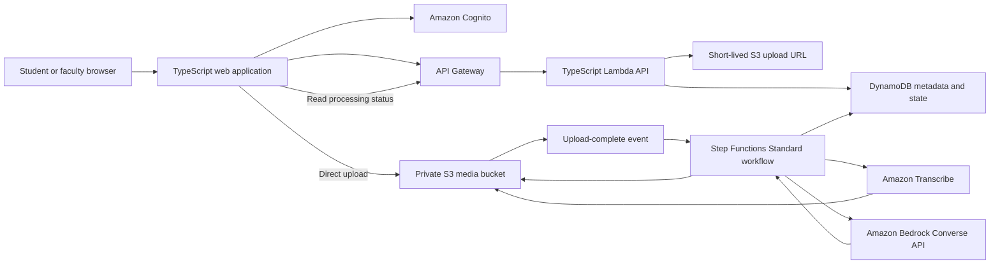

# GWLearn architecture

## System boundary

GWLearn accepts lecture video, produces a timestamped transcript, and generates learning artifacts that remain traceable to that transcript. Large objects live in Amazon S3; durable metadata and workflow state live in DynamoDB.



## Processing states

```text
CREATED → UPLOADING → QUEUED → TRANSCRIBING → GENERATING → READY
                ↘ INVALID                         ↘ FAILED
```

State transitions use conditional DynamoDB writes. Upload completion and generation requests carry idempotency keys so duplicate browser requests or storage events cannot start duplicate paid work.

## Storage boundaries

S3 stores:

- Original video and optional derived audio.
- Transcript JSON and timestamp segments.
- Generated artifact exports.
- Thumbnails and other binary assets.

DynamoDB stores:

- User and video metadata.
- Ownership, role, and visibility state.
- Processing executions and failure summaries.
- Generated-artifact metadata, prompt version, model ID, and token usage.
- Short-lived chat sessions and messages.

Video bytes and full transcript bodies do not belong in DynamoDB.

## Security boundary

- The API derives user identity from a verified Cognito token.
- Client-supplied owner identifiers are never authoritative.
- S3 Block Public Access remains enabled.
- Upload and download access is short-lived and scoped to one object key.
- AWS credentials and Bedrock access never enter browser code.
- AI output is treated as untrusted content and rendered as text unless explicitly sanitized.
- Logs avoid storing credentials and full private transcripts.

## Cost boundary

- Limit media size, duration, type, and concurrent jobs per user.
- Track transcription duration and Bedrock input/output tokens per artifact.
- Cache completed artifacts by video, type, source version, and prompt version.
- Expire abandoned uploads and short-lived chat history.
- Use a small licensed sample lecture for the public portfolio path.
